# Documentação do Projeto

## Índice
1. [Visão Geral](#visão-geral)
2. [Artefatos Globais](#artefatos-globais)
   - [C4 Model](#c4-model)
   - [Modelo de Domínio](#modelo-de-domínio)
   - [Glossário](#glossário)
   - [Diagramas de Caso de Uso](#diagramas-de-caso-de-uso)
3. [Vistas e Granularidade](#vistas-e-granularidade)
   - [Nível 1](#nível-1)
   - [Nível 2](#nível-2)
   - [Nível 3](#nível-3)
   - [Nível 3.5](#nível-35)

## Visão Geral

Este repositório contém a documentação detalhada do projeto, organizada em várias categorias e níveis de granularidade. A documentação está dividida em artefatos globais e vistas detalhadas, cobrindo desde diagramas de alto nível até implementações específicas de domínio.

## Artefatos Globais

### C4 Model
Esta seção contém os diferentes níveis do modelo C4 (Contexto, Containers, Componentes e Código) para a arquitetura do sistema. O modelo C4 descreve a estrutura do sistema em diferentes níveis de abstração, oferecendo uma visão clara de como os componentes interagem entre si.

- **Nível 1**: Visão de contexto do sistema, mostrando as interações externas.

  

- **Nível 2**: Visão de container, representando os principais containers e como eles se comunicam.

  

- **Nível 3**: Visão de componentes, detalhando a arquitetura interna dos containers.

  

- **Nível 4**: Visão de código, descrevendo as interações a nível de classe.

  

### Modelo de Domínio

- **Versão 1**: Diagrama do modelo de domínio na versão inicial.

  

- **Versão 2**: Atualização do modelo de domínio com melhorias e ajustes.

  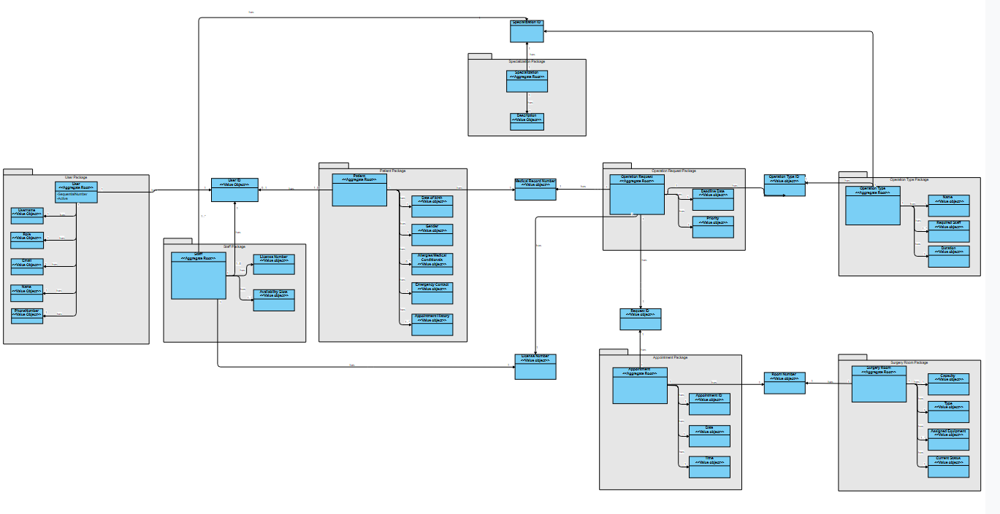

### Glossário
- **Glossário**: O glossário fornece definições para os principais termos e conceitos utilizados ao longo do projeto.

  [Glossário](Glossary/Glossary.md)

### Diagramas de Caso de Uso
- **Use Case Diagram**: Representação dos principais casos de uso do sistema.

  

## Vistas e Granularidade

Abaixo estão os diagramas que representam diferentes vistas e níveis de detalhamento do sistema.

# User storie de edição

### Nível 1
- **Logical**: Visão lógica do sistema no Nível 1.

  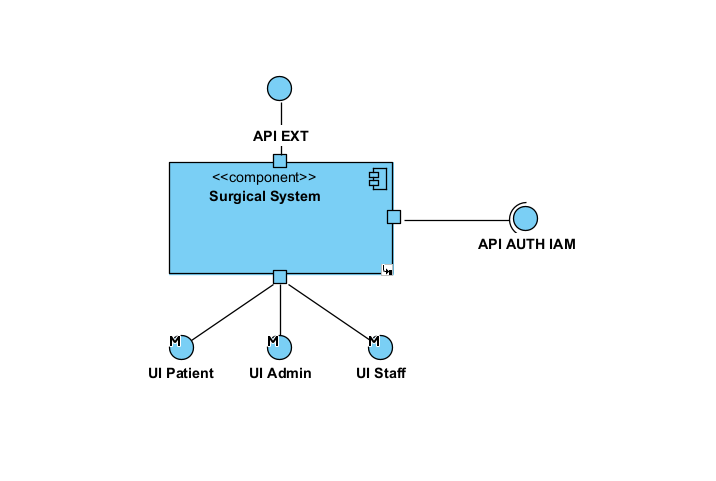

- **Process**: Diagrama de processos no Nível 1.

  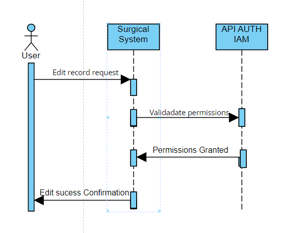

- **Scenarios**: Cenários de uso no Nível 1.

  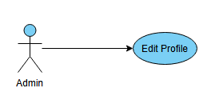

### Nível 2
- **Development**: Visão de desenvolvimento no Nível 2.

  

- **Logical**: Visão lógica no Nível 2.

  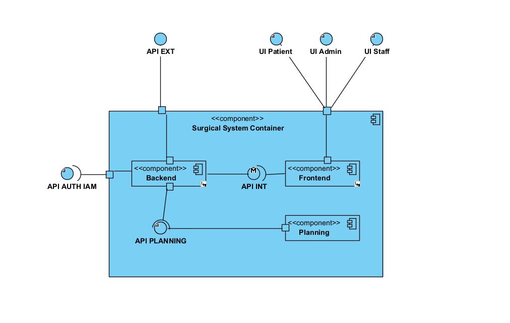

- **Physical**: Visão física da arquitetura no Nível 2.

  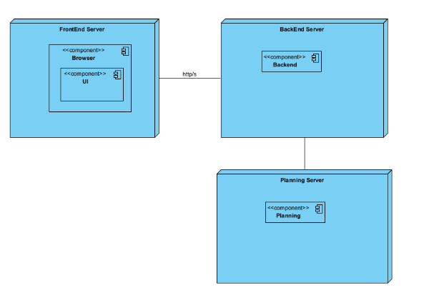

- **Process**: Detalhes de processo no Nível 2.

  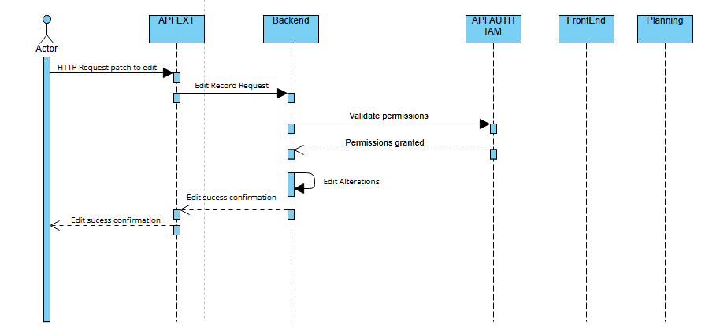

### Nível 3
- **Development**: Visão de desenvolvimento no Nível 3.

  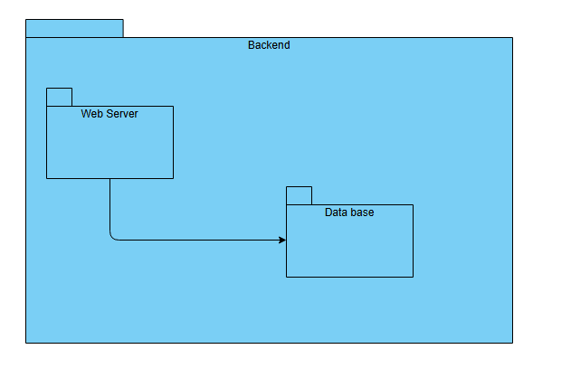

- **Logical**: Visão lógica no Nível 3.

  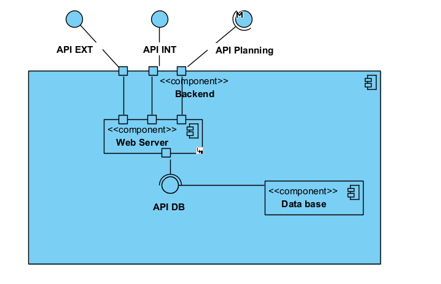

- **Process**: Diagrama de processo no Nível 3.

  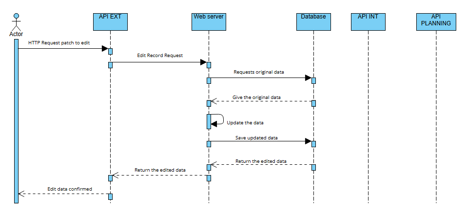

### Nível 3.5
- **Logical**: Visão lógica adicional no Nível 3.5.

  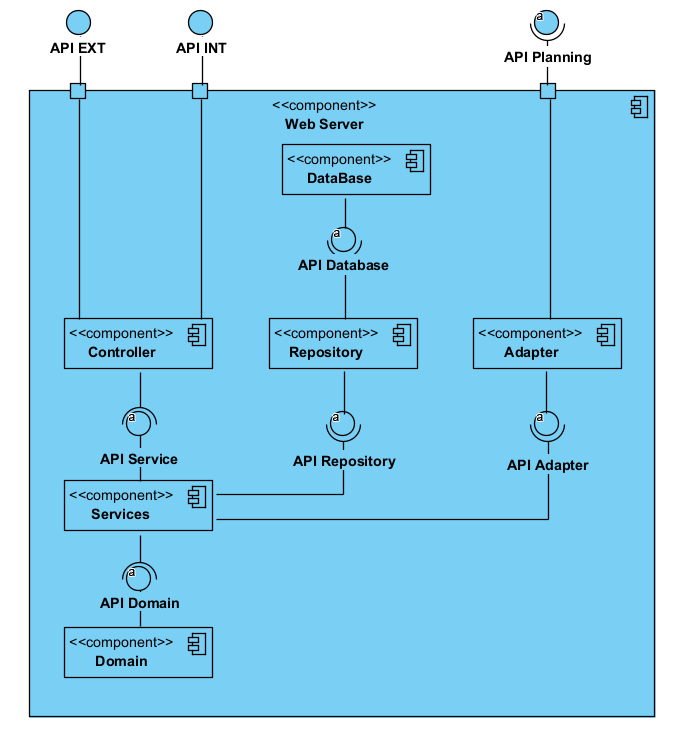

- **SystemDiagramEdit**: Edição do diagrama do sistema no Nível 3.5.

  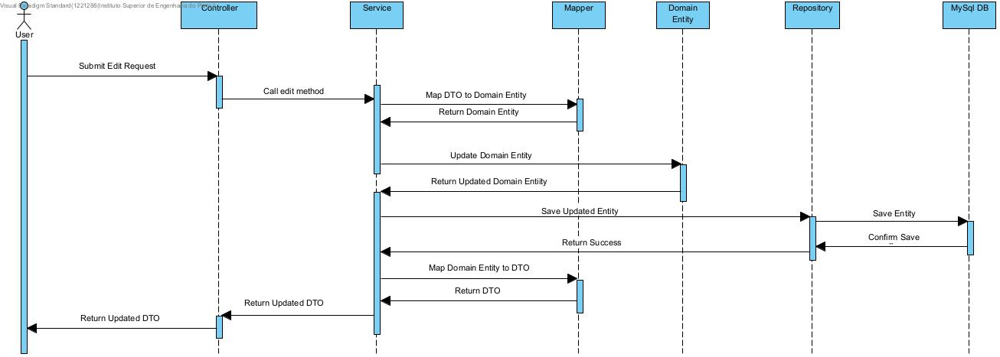
