# Documentação do Projeto

## Índice
- [Documentação do Projeto](#documentação-do-projeto)
  - [Índice](#índice)
  - [Visão Geral](#visão-geral)
  - [Artefatos Globais](#artefatos-globais)
    - [Modelo de Domínio](#modelo-de-domínio)
    - [Glossário](#glossário)
    - [Diagramas de Caso de Uso](#diagramas-de-caso-de-uso)
  - [Vistas e Granularidade](#vistas-e-granularidade)
- [User storie de edição](#user-storie-de-edição)
    - [Nível 1](#nível-1)
    - [Nível 2](#nível-2)
    - [Nível 3](#nível-3)

## Visão Geral

Este repositório contém a documentação detalhada do projeto, organizada em várias categorias e níveis de granularidade. A documentação está dividida em artefatos globais e vistas detalhadas, cobrindo desde diagramas de alto nível até implementações específicas de domínio.

## Artefatos Globais

### Modelo de Domínio

- **Versão 1**: Diagrama do modelo de domínio na versão inicial.

  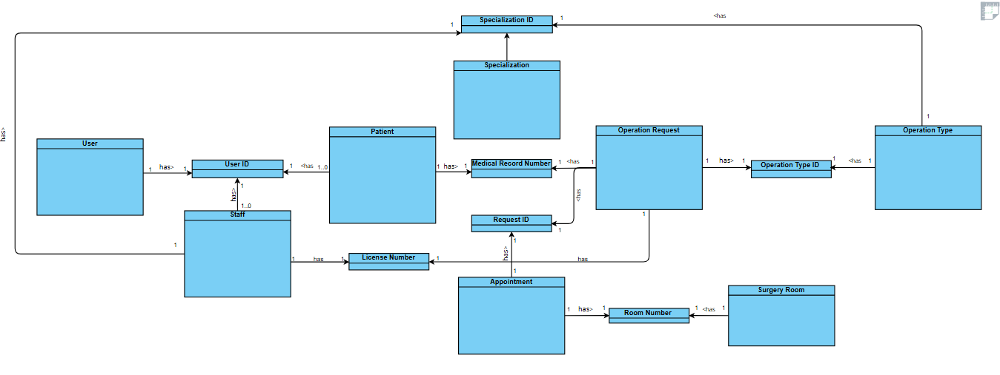

- **Versão 2**: Atualização do modelo de domínio com melhorias e ajustes.

  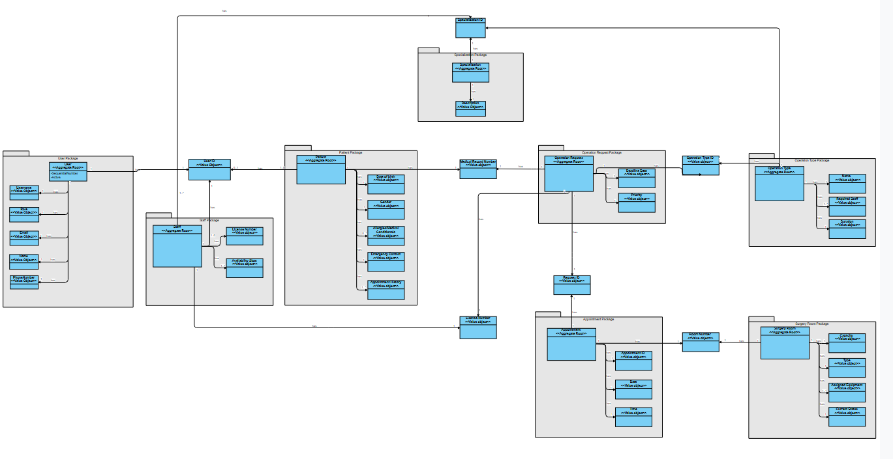

### Glossário
- **Glossário**: O glossário fornece definições para os principais termos e conceitos utilizados ao longo do projeto.

  [Glossário](Glossary/Glossary.md)

### Diagramas de Caso de Uso
- **Use Case Diagram**: Representação dos principais casos de uso do sistema.

  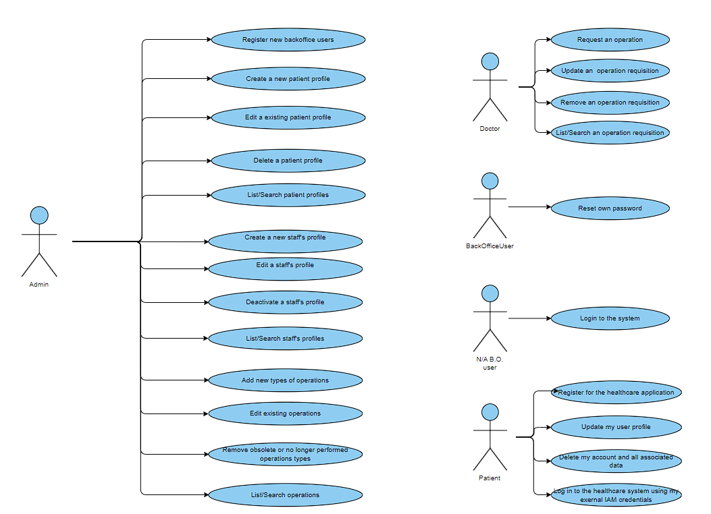

## Vistas e Granularidade

Abaixo estão os diagramas que representam diferentes vistas e níveis de detalhamento do sistema.

# User storie de edição

### Nível 1
- **Logical**: Visão lógica do sistema no Nível 1.

  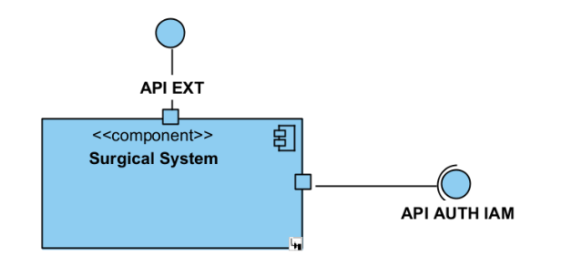

- **Process**: Diagrama de processos no Nível 1.

  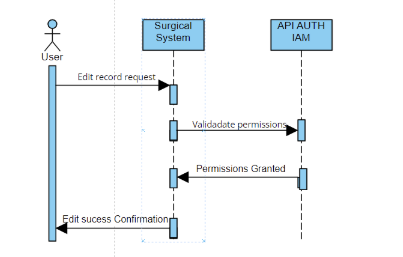

- **Scenarios**: Cenários de uso no Nível 1.

  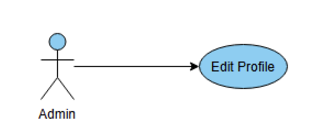

### Nível 2
- **Development**: Visão de desenvolvimento no Nível 2.

  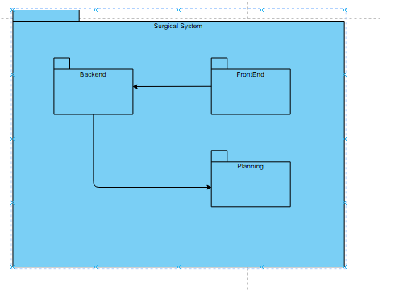

- **Logical**: Visão lógica no Nível 2.

  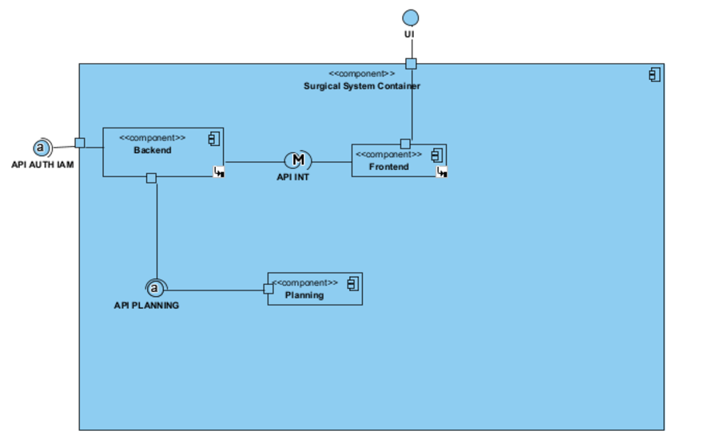

- **Physical**: Visão física da arquitetura no Nível 2.

  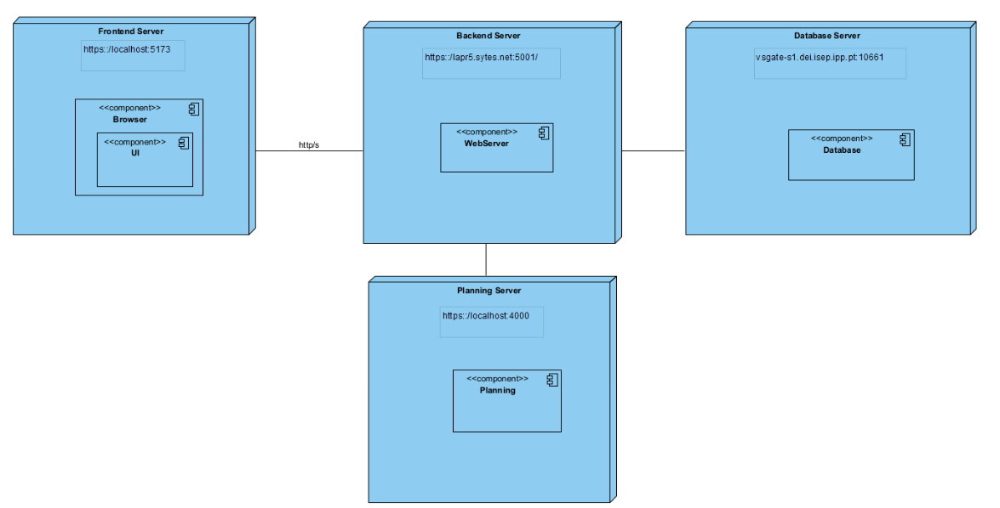

- **Process**: Detalhes de processo no Nível 2.

  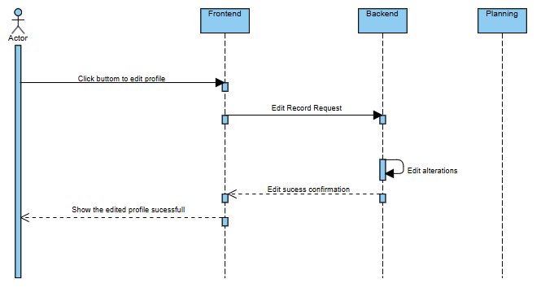

### Nível 3
- **Development**: Visão de desenvolvimento no Nível 3.

  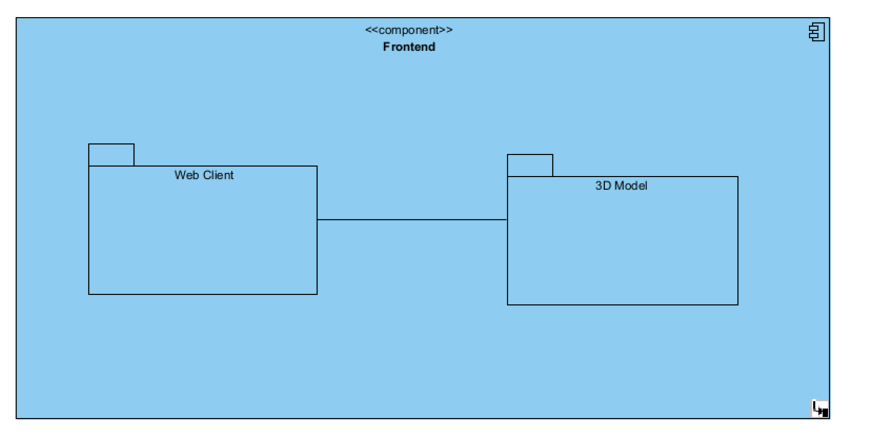

- **Logical**: Visão lógica no Nível 3.

  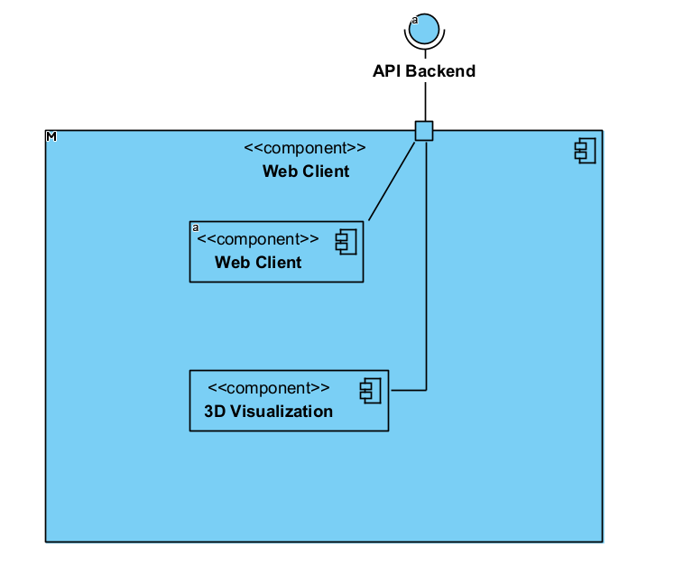

- **Process**: Diagrama de processo no Nível 3.

  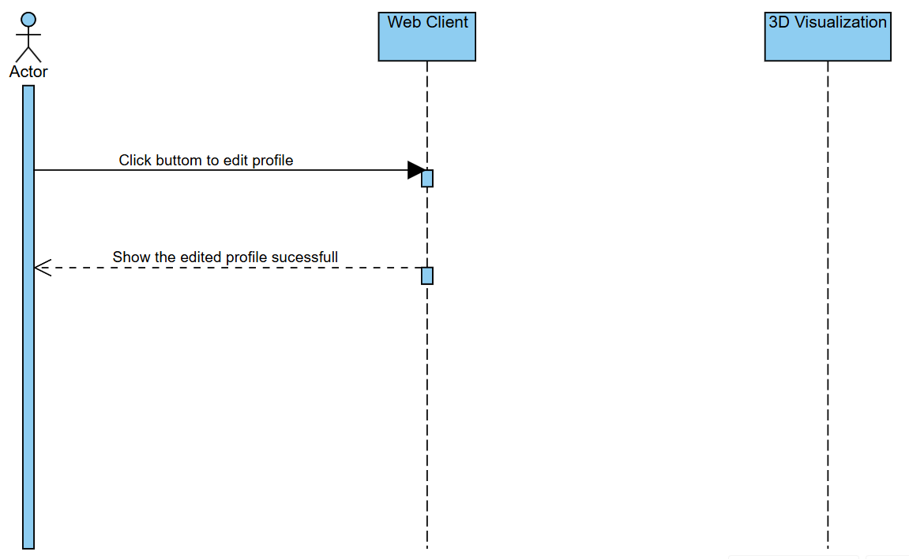

